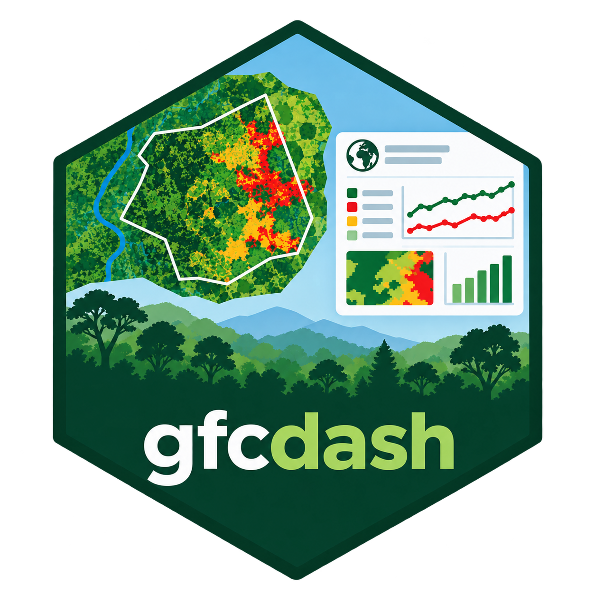
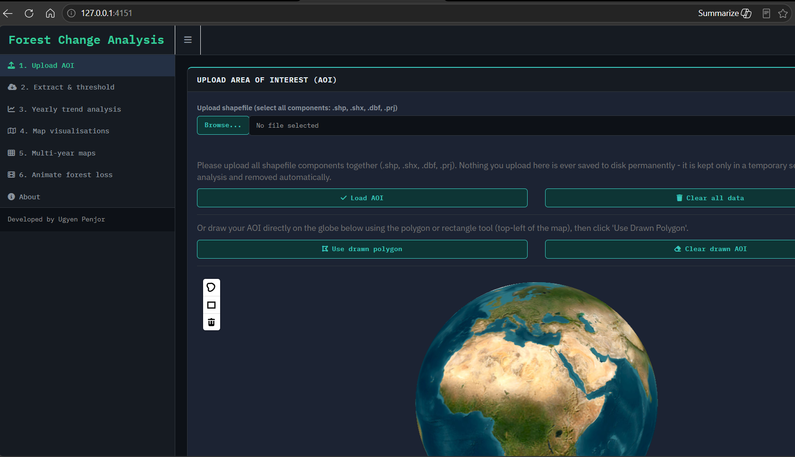
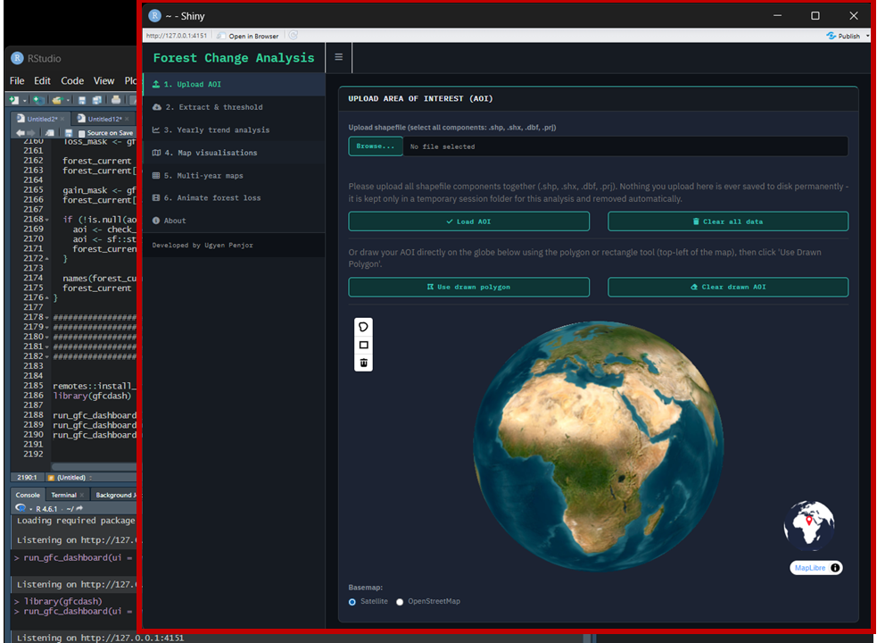
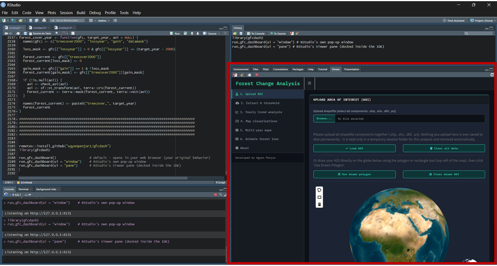

<table style="border-color: transparent;">
<tr>
<td style="width: 80%; border: none;">
<h1>
gfcdash
</h1>
An interactive Shiny dashboard for Global Forest Change (GFC) analysis.
Upload a shapefile or draw an Area of Interest (AOI) directly on a 3D globe,
download and threshold the relevant Hansen et al. GFC tiles, compute
year-by-year forest cover and loss statistics, build classified change
maps and multi-panel comparisons, and animate the full time series.
</td>
<td style="border: 1px solid transparent; text-align: right;">

</td>
</tr>
</table>

## Installation

You don't need to install any of the underlying packages yourself - R will
fetch every dependency (`shiny`, `sf`, `terra`, `mapgl`, and so on)
automatically the first time you install `gfcdash`.

### From GitHub (current)

```r
if (!requireNamespace("remotes", quietly = TRUE)) install.packages("remotes")
remotes::install_github("yourusername/gfcdash")
```

### From CRAN (once published)

```r
install.packages("gfcdash")
```

## Usage

```r
library(gfcdash)
run_gfc_dashboard()                 # default - opens in your web browser
```
This opens the dashboard in your default web browser.

<p align="center">


</p>

## OR
```r
run_gfc_dashboard(ui = "window")    # RStudio's own pop-up window
```
This opens the dashboard as a separate pop-up window of RStudio. 

<p align="center">


</p>

## OR
```r
run_gfc_dashboard(ui = "pane")      # RStudio's viewer pane (docked inside the IDE)
```
This opens the dashboard in RStudio's Viewer pane (generally not recommended). 

<p align="center">


</p>

Everything the
dashboard creates during a session - downloaded Hansen tiles, merged and
thresholded rasters, annual layers, plots, and animations - is written to
a private, temporary folder that is deleted automatically when the
session ends. You never need to set or think about a file path; anything
you want to keep, download using the buttons provided in the app.

## Keeping dependencies up to date

From inside the dashboard (About tab), click "Check for Package Updates"
to check whether any of gfcdash's dependencies have newer CRAN versions
available, and install them if so. This is a manual, on-demand check -
dependencies are never silently auto-updated.

## Data source

Hansen, M. C., P. V. Potapov, R. Moore, M. Hancher, S. A. Turubanova,
A. Tyukavina, D. Thau, S. V. Stehman, S. J. Goetz, T. R. Loveland,
A. Kommareddy, A. Egorov, L. Chini, C. O. Justice, and J. R. G. Townshend.
2013. High-Resolution Global Maps of 21st-Century Forest Cover Change.
*Science* 342: 850-53.

## Author

Ugyen Penjor, Fauna & Flora
